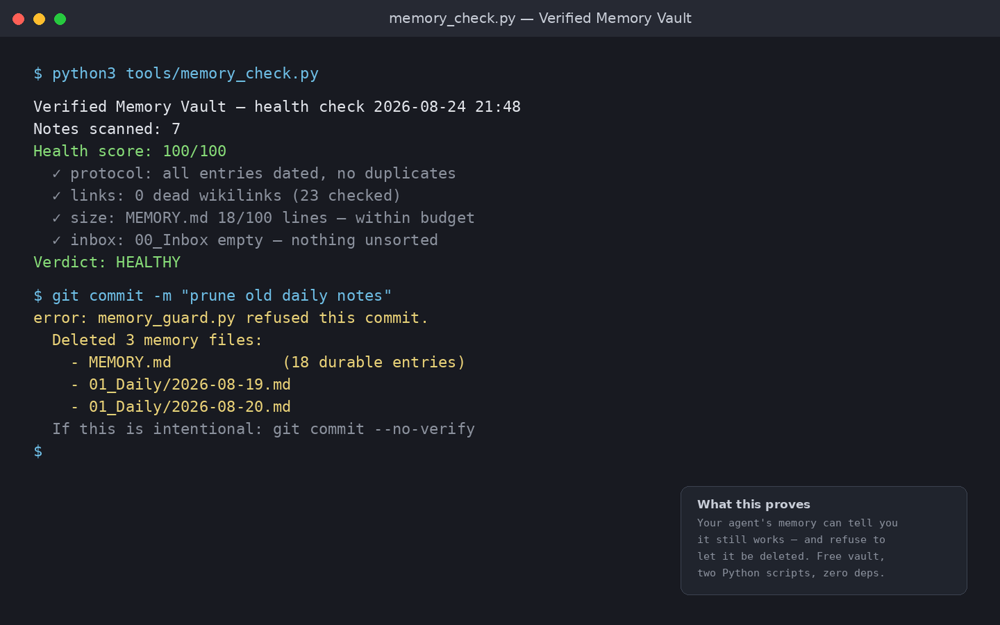

# Verified Memory Vault — A Self-Checking Obsidian Vault for AI Coding Agents

**Free · Obsidian vault · Persistent memory for agents that proves it works**

A small vault that gives AI coding agents (Claude Code, Codex, Gemini CLI, …)
a **persistent memory** — and, unlike a bare folder structure, it **checks
itself and protects itself**:

- `memory_check.py` scores the memory's health at any time: protocol
  violations, dead links, bloat, inbox pressure. One command, honest report.
- `memory_guard.py` (optional git hook) refuses the commit that deletes your
  agent's brain — the documented way agent memories die.

> Companion to the human-side **Second Brain Starter** — the free starter
> vault for people who want a working note system in 10 minutes.
> https://secondbrainstarter.github.io/

---

## Why this exists

"Give your agent an Obsidian vault as memory" is now a known idea. What
breaks in practice is not the idea but the maintenance:

1. Memory rots — undated entries, duplicates, and speculation fossilize,
   and a bloated MEMORY.md quietly eats the context window.
2. Memory dies — agents occasionally delete or rewrite their own memory
   files while "cleaning up".
3. Nobody notices until it's too late — a folder structure cannot tell you
   whether it still works.

This vault addresses all three with two dependency-free Python scripts and
a strict protocol. No Node, no TypeScript, no plugins, no database — if you
can run `python3`, you can verify your agent's memory.

## What's inside

- `CLAUDE.md` — boot file every agent reads first (rules + protocol)
- `MEMORY.md` — durable memory: dated, append-only, one line per fact
- `01_Daily/` — one note per session: work done, decisions, blockers
- `00_Inbox/` — capture everything; sort later
- `02_Templates/` — daily note templates (EN + DE)
- `tools/memory_check.py` — health check (score, problems, exit code).
  The score is telemetry for humans; the **exit code is the contract**:
  gate session-shutdown hooks or CI steps on it (0 = healthy, 1 = degraded),
  not on the score.
- `tools/memory_guard.py` — git pre-commit guard against mass deletion
  (file count AND absolute removed-lines cap) and history rewrites of
  MEMORY.md

## Quick start (10 minutes)

1. Install Obsidian (free): https://obsidian.md
2. Download the vault: [verified-memory-vault-v0.9.zip](https://github.com/secondbrainstarter/verified-memory-vault/releases/download/v0.9.0/verified-memory-vault-v0.9.zip) — or clone this repo.
3. Unzip → Obsidian → "Open folder as vault". Daily notes and templates are
   preconfigured.
4. (Recommended) Make it a git repo and install the guard:
   `git init && ln -s ../../tools/memory_guard.py .git/hooks/pre-commit`
5. Tell your agent to read `CLAUDE.md` at session start and to run
   `python3 tools/memory_check.py` once per session.
6. End of session: fill the daily note, promote durable facts to `MEMORY.md`.
   That's the whole habit — and now it's verifiable.

Gate automation on exit codes, not scores: `memory_check.py` returns 0
(healthy) or 1 (degraded) — hook that into session shutdown or CI. The
printed score is a dashboard for you, not a contract for machines.

## The three rules

1. **Capture, don't sort.** Everything lands in `00_Inbox/` first.
2. **Every session leaves a daily note.** So the next session resumes cold.
3. **Promote durable facts to `MEMORY.md`.** Append-only, dated, one line,
   verifiable only.

## How this differs

- vs. plain vault templates: this one *checks* its own state instead of
  assuming it.
- vs. heavy agent-memory frameworks (hooks, MCP servers, semantic search):
  everything here is readable Markdown plus two ~200-line stdlib scripts —
  you can audit all of it in ten minutes.
- Bilingual by design (EN + DE); the agent mirrors your language.

## License

Vault content: CC BY 4.0 — free to use, including commercially; attribution
required (`LICENSE.md`). Tools under `tools/`: MIT.
